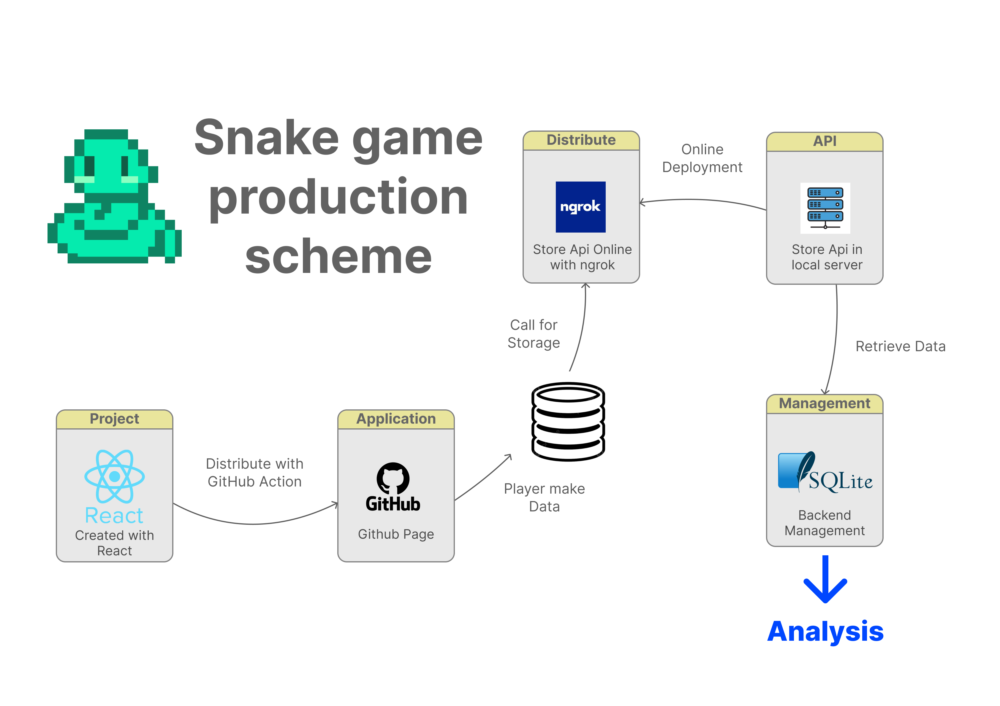

# AI Snake Game

[](LICENSE)

Here is my dashboard presenting a data analysis of a Snake game I created in another repository. This project explain the methodology of data retrieval as well as its processing in order to grasp how the testers of our Snake game play.  

## Description  

Different sensors make it possible to recover the movements of the snake in the Snake Game, then are sent to an API allowing the players' playing methods to be analyzed in order to carry out a gameplay study. Then I recovered the database with sqlite3 and analysed them.  



## Table of Contents

- [Getting Started](#Getting-Started)
- [Launch Application](#Launch-Application)
- [Contributing](#Contributing)
- [License](#License)  

## Getting Started    

```bash
git clone https://github.com/HaDock404/ai-game-snake.git
cd ai-game-snake
npm install
```  

## Launch Application    

```bash
npm start
```  

## Contributing

Pull requests are welcome. For major changes, please open an issue first
to discuss what you would like to change.

Please make sure to update tests as appropriate.

## License  

This project is licensed under the MIT License - see the [LICENSE](./LICENSE) file for details.